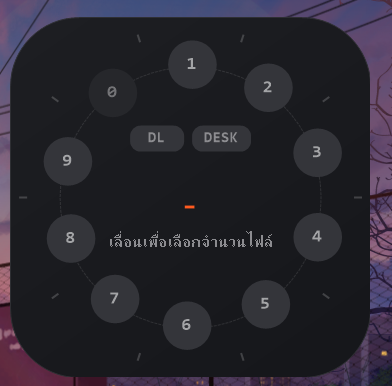
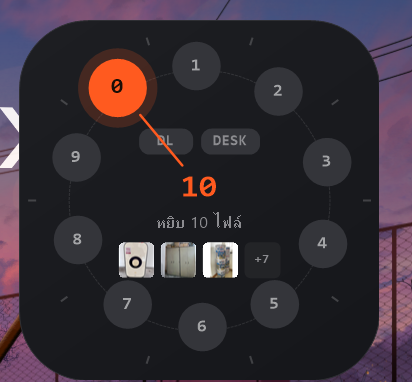

# Yib for Windows

สวัสดีครับ! 🎉

นี่คือ `Yib for Windows` — แอปเล็กๆ ที่อยู่ใน System Tray ช่วยให้คุณดึงไฟล์ล่าสุดจากโฟลเดอร์ (Downloads / Desktop / โฟลเดอร์กำหนดเอง) แล้ววาง (paste) เข้าแอปอื่นได้เร็วขึ้น โดยไม่ต้องเปิดโฟลเดอร์หรือลากไฟล์ข้ามหน้าต่างให้วุ่น

## จุดเด่นในเวอร์ชันแรก
- เขย่าเมาส์เพื่อเรียกวงล้อ แล้วเลือกหมายเลขเพื่อดึงไฟล์ล่าสุดจำนวนที่ต้องการ
- รองรับช่องทางไฟล์ 3 ช่อง: `Downloads`, `Desktop`, และ `Custom` (กำหนดเอง)
- ตัวคูณไฟล์ (x1, x2, x5, x10) เพื่อเลือกจำนวนไฟล์ได้รวดเร็ว
- เสียงคลิกและปรับระดับเสียงได้
- เมนู Tray มีตัวเลือก `เริ่มทำงานตอนเปิดเครื่อง` (จะเขียนค่าใน Registry ของผู้ใช้)
- ปล่อยเป็นไฟล์ `.exe` แบบ self-contained — ดาวน์โหลดแล้วรันได้ทันที (ไม่ต้องลง .NET เพิ่ม)

## วิธีใช้งานสั้นๆ
1. ดาวน์โหลด `Yib.exe` จาก Release (ดูด้านล่าง) แล้วรัน — ไอคอนจะโผล่ที่ System Tray
2. เขย่าเมาส์เพื่อเรียกวงล้อ → ชี้หมายเลข → คลิก
3. โปรแกรมจะนำไฟล์ล่าสุดจากโฟลเดอร์ที่เลือกมาใส่ใน Clipboard (เป็นรายการไฟล์) แล้วส่ง `Ctrl+V` ให้หน้าต่างที่คุณใช้อยู่

## วิธี build (สำหรับนักพัฒนา)
จากโฟลเดอร์โปรเจกต์ (ไฟล์ `.csproj` อยู่ใน `Yib/`):

```powershell
cd "Yib"
dotnet publish -c Release -r win-x64 --self-contained true
```

ไฟล์ที่ได้จะอยู่ที่:

```
Yib/bin/Release/net8.0-windows/win-x64/publish/Yib.exe
```

## ดาวน์โหลด
ไฟล์ `.exe` ของ release เวอร์ชันแรกถูกอัปโหลดแล้วที่ Releases ของ repository:

https://github.com/ManaphatDev/YibForWindows/releases/tag/v0.1.0

## รูปตัวอย่าง
ตัวอย่างหน้าจอของวงล้อ (ตัวอย่างภาพให้วางไว้ใน `docs/images/` ชื่อไฟล์ `dial1.png` และ `dial2.png`):





ถ้าคุณลากไฟล์รูปภาพสองไฟล์ที่ผมส่งมาไว้ที่โฟลเดอร์ `docs/images/` (หรืออัปโหลดผ่าน GitHub web UI) รูปจะแสดงใน README โดยอัตโนมัติ.

## ปัญหาที่อาจพบและคำแนะนำ

## ถ้าต้องการให้ช่วยต่อ
- ผมช่วยสร้าง installer (MSI/NSIS/Inno) ให้เพื่อการแจกจ่ายที่สะดวกได้
- หรือต้องการให้ผมอธิบายวิธีใช้งานแบบสั้น ๆ เพื่อใส่ใน Release Notes ก็ได้

ขอบคุณที่ลองใช้ Yib — ถ้ามีฟีเจอร์ที่อยากให้เพิ่มหรือบั๊กแจ้งมาได้เลยนะครับ 🙂

##เครดิต : Peesamac


